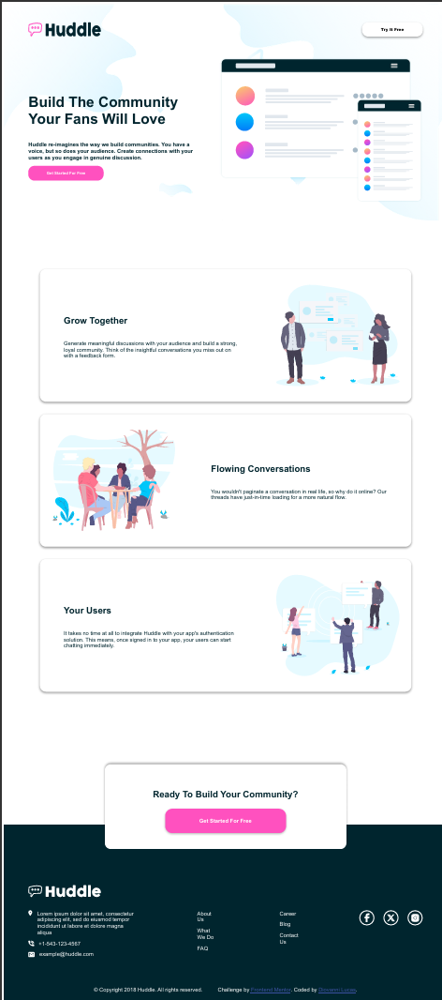

# Frontend Mentor - Huddle landing page with alternating feature blocks solution

This is a solution to the [Huddle landing page with alternating feature blocks challenge on Frontend Mentor](https://www.frontendmentor.io/challenges/huddle-landing-page-with-alternating-feature-blocks-5ca5f5981e82137ec91a5100). Frontend Mentor challenges help you improve your coding skills by building realistic projects. 

## Table of contents

  - [The challenge](#the-challenge)
  - [Screenshot](#screenshot)
  - [Links](#links)
- [My process](#my-process)
  - [Built with](#built-with)
  - [What I learned](#what-i-learned)
  - [Continued development](#continued-development)
- [Author](#author)


### The challenge

Users should be able to:

- View the optimal layout for the site depending on their device's screen size
- See hover states for all interactive elements on the page

### Screenshot




### Links

- Solution URL: [Solução FrontEndMentor](https://www.frontendmentor.io/solutions/huddle-landing-page-responsivo-para-telas-menores-f5Yiu3u2EZ)
- Live Site URL: [Live Server Site](https://front-end-mentor-huddle-landing-page-eta.vercel.app)

## My process

### Built with

- Semantic HTML5 markup
- CSS custom properties
- Flexbox


### What I learned

Durante a execução deste projeto, consegui aprender mais sobre a variavel @media e como posso utilizá-la para criar funções e mudanças de acordo com a largura e responsividade da página e do conteúdo.


```css
@media(max-width: 600px){

    .hero__content{
        background-image: url(/images/bg-hero-mobile.svg);
        padding: 0 20px 10px 20px;

        .hero__header{
            align-items: center;
            padding: 0;

            .header__logo{
                width: 124px;
                height: 20px;
            }

            .header__action{
                width: 116px;
                height: 30px;
            }
         
        }
    }
}
/*continues..*/
```

### Continued development

sinto que ainda  tenho muito a aprender sobre a responsividade e como posso melhorar a experiência do  usuário em diferentes dispositivos e tamanhos de tela. Estou ansioso para continuar aprendendo  e melhorando minhas habilidades em desenvolvimento web.


## Author

- Linkedin - [Diovanni Lucas](https://www.linkedin.com/in/diovanni-ls2004/)
- Frontend Mentor - [@Diovanni-ls](https://www.frontendmentor.io/profile/Diovanni-ls)


